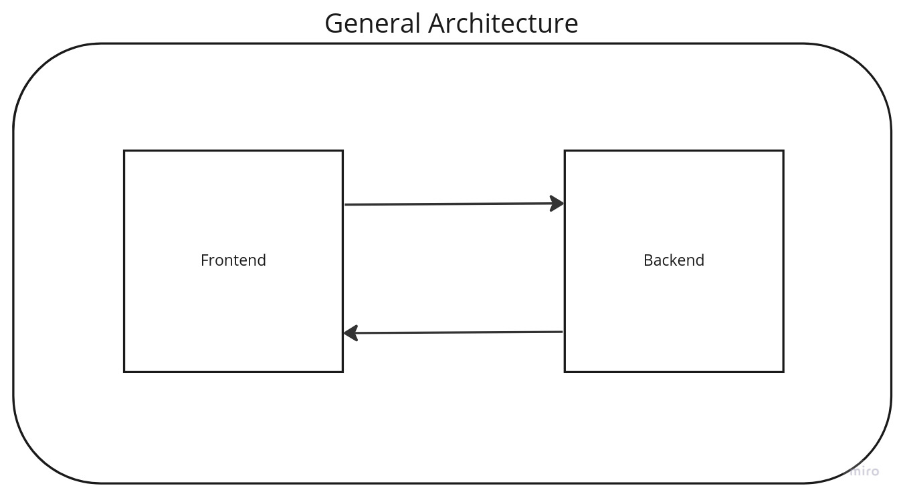
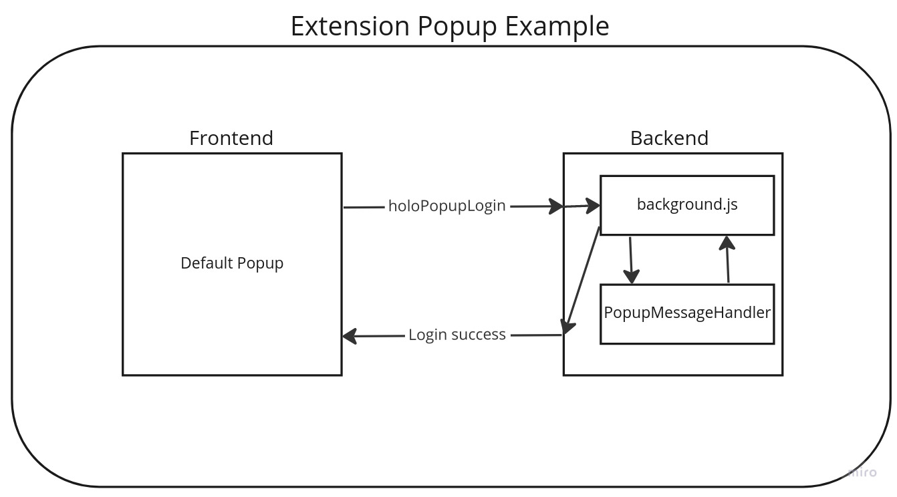
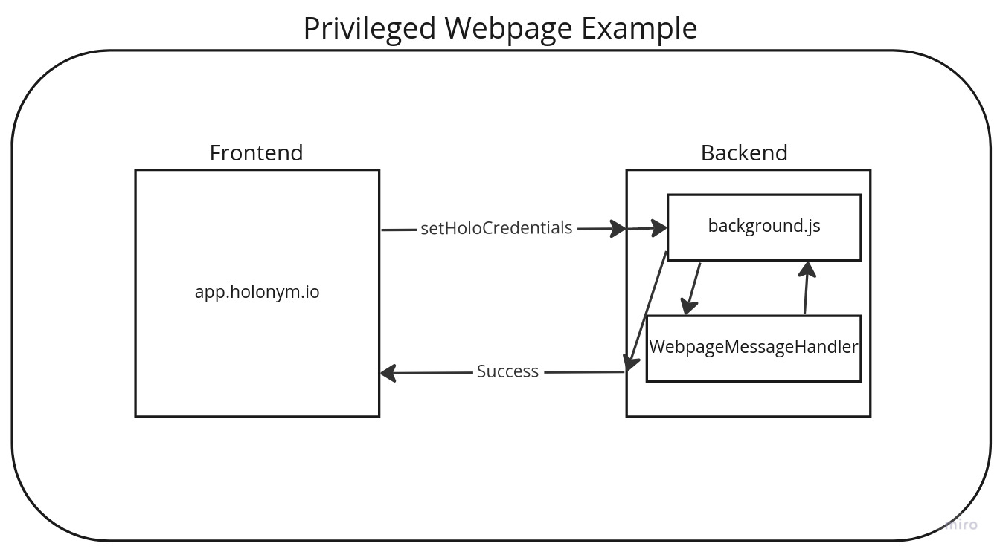
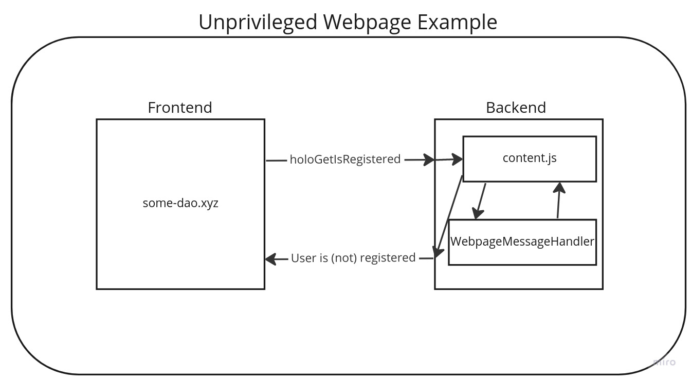

# Extension overview

**The primary purpose of the Holonym browser extension is to encrypt and store users' credentials.**

Auxiliary purposes include:

- Displaying credentials to users.
- Providing links to Holonym webpages where users can get credentials and generate proofs.
- Storing metadata about leaves users have added to the Privacy Pool or proofs users have generated.
- Giving webpages access to metadata (e.g., whether the user has already set their extension password) that allows webpages to provide better UX while users interact with the extension.

## Components

The extension consists of both a _backend_ and a set of _popups_. The extension also interacts with two types of external webpages: _privileged webpages_ and _unprivileged webpages_.

#### Backend

- HoloStore (wrapper around chrome.storage)
- CryptoController (handles password, keypair, and encryption/decryption)
- background.js (listens for messages from extension and privileged webpages)
- WebpageMessageHandler (handles messages from privileged and unprivileged webpages)
- PopupMessageHandler (handles messages from popups spawned by the extension)

#### Popups

- Default popup
- Credentials confirmation popup
- Share credentials confirmation popup
- Prompt set password popup

#### External components

- Privileged webpages (webpages at domains owned by Holonym)
- Unprivileged webpages (webpages at domains _not_ owned by Holonym)

The purpose of separating webpages into the categories of privileged and unprivileged is to allow the extension to retrieve credentials from the Holonym website and to prevent malicious sites from prompting the user to store unnecessary credentials.

### Architecture diagrams

It is helpful to consider the extension system to consist of a backend with various types of frontends. The frontends are:

- Popups spawned by the extension
- Privileged webpages
- Unprivileged webpages

The backend is like a REST API that responds to requests from the different frontends. Each type of frontend can send requests to some set of the backend endpoints. For example, a popup can send a login request, but no webpage can send a login request. Another example, all frontends can query whether the user is registered.

One should note, however, that the meaning of "backend" in these docs includes both the "background" (or "service worker") and "content" scripts described in the developer docs from Chrome. In the Chrome extension architecture, there are really three components (background, content, and webpage), not just the two described here (backend and frontend).

<!--  -->

<!--  -->

<!--  -->

<!--  -->
